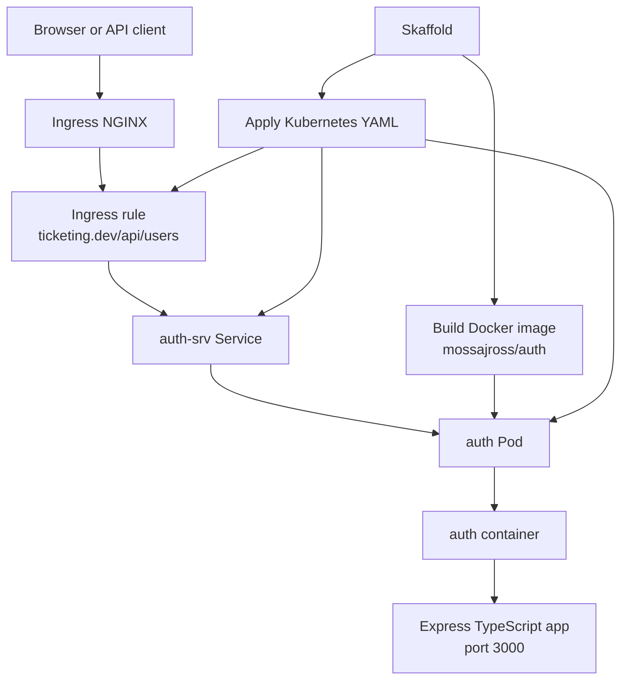

# Ticketing App

A learning-focused microservices ticketing application built with Node.js, Express, TypeScript, Docker, Kubernetes, Minikube, Ingress NGINX, and Skaffold.

The current project starts with an `auth` service and the local infrastructure needed to run it inside a Kubernetes cluster. The goal is to learn production-style service boundaries and deployment mechanics while building the app incrementally.

## Current Architecture



Request flow:

```txt
https://ticketing.dev/api/users/currentuser
  -> /etc/hosts maps ticketing.dev to Minikube
  -> Ingress NGINX receives the request
  -> Ingress routes /api/users traffic to auth-srv
  -> auth-srv forwards to an auth Pod
  -> Express handles the route
```

## Repository Structure

```txt
.
├── auth/
│   ├── Dockerfile
│   ├── package.json
│   ├── package-lock.json
│   ├── src/
│   │   ├── index.ts
│   │   ├── routes/
│   │   ├── middlewares/
│   │   └── errors/
│   └── tsconfig.json
├── infra/
│   └── k8s/
│       ├── auth-depl.yaml
│       └── ingress-srv.yaml
├── docs/
│   └── infrastructure-guide.md
├── skaffold.yaml
├── .gitignore
└── README.md
```

## Important Files

`auth/Dockerfile`

Builds the Docker image for the auth service.

`infra/k8s/auth-depl.yaml`

Defines the auth Kubernetes Deployment and Service.

`infra/k8s/ingress-srv.yaml`

Defines the Ingress route that sends `/api/users` traffic to the auth service.

`skaffold.yaml`

Automates the local Kubernetes development loop: build image, apply manifests, stream logs, and sync changed TypeScript files.

`docs/infrastructure-guide.md`

Detailed learning notes explaining Docker, Kubernetes, Ingress NGINX, Skaffold, and the YAML files.

## Prerequisites

Install these tools on Ubuntu:

- Node.js and npm
- Docker
- kubectl
- Minikube
- Skaffold

Check them with:

```bash
node --version
npm --version
docker --version
kubectl version --client
minikube version
skaffold version
```

## Local Service Development Without Kubernetes

Use this when you only want to run the auth service directly.

```bash
cd auth
npm install
npm start
```

The auth service runs with:

```bash
tsx watch src/index.ts
```

Type-check the service:

```bash
cd auth
npm run typecheck
```

## Kubernetes Development With Minikube and Skaffold

Start Minikube:

```bash
minikube start --driver=docker
```

Enable Ingress NGINX:

```bash
minikube addons enable ingress
```

Check cluster health:

```bash
minikube status
kubectl get nodes
kubectl get pods -A
```

Map the local development domain to Minikube:

```bash
minikube ip
```

Add the returned IP to `/etc/hosts`:

```txt
<minikube-ip> ticketing.dev
```

Example:

```txt
192.168.49.2 ticketing.dev
```

Run the full development loop:

```bash
skaffold dev
```

Skaffold will build the auth image, deploy the Kubernetes YAML files, stream logs, and sync TypeScript changes into the running container.

## Useful Kubernetes Commands

Inspect app resources:

```bash
kubectl get pods
kubectl get services
kubectl get ingress
kubectl get deployments
```

Debug a Pod:

```bash
kubectl describe pod <pod-name>
kubectl logs <pod-name>
kubectl exec -it <pod-name> -- sh
```

Inspect Ingress routing:

```bash
kubectl describe ingress ingress-service
```

Test the auth route through Ingress:

```bash
curl -k https://ticketing.dev/api/users/currentuser
```

If `/etc/hosts` is not configured yet, test directly against the Minikube IP:

```bash
curl -k -H 'Host: ticketing.dev' https://$(minikube ip)/api/users/currentuser
```

## Auth Service Routes

Current route files live in `auth/src/routes`.

Known routes:

```txt
GET  /api/users/currentuser
POST /api/users/signup
POST /api/users/signin
POST /api/users/signout
```

The signup route currently includes request validation and intentionally throws a database connection error while the persistence layer is still being built.

## What Should Be Committed

Commit source code, configuration, and documentation:

```txt
auth/src/
auth/Dockerfile
auth/.dockerignore
auth/package.json
auth/package-lock.json
auth/tsconfig.json
infra/k8s/
skaffold.yaml
docs/
README.md
.gitignore
```

Generated dependencies should not be committed:

```txt
auth/node_modules/
```

Local machine configuration should not be committed:

```txt
/etc/hosts entries
.env files
local kubeconfig files
editor settings
logs
build outputs
```

## Git Hygiene

This repository ignores generated dependency folders and local machine files through `.gitignore`.

If `node_modules` was accidentally committed before `.gitignore` existed, remove it from Git tracking while keeping it locally:

```bash
git rm -r --cached auth/node_modules
git commit -m "Remove generated dependencies from repository"
```

After cloning the project again, recreate dependencies with:

```bash
cd auth
npm install
```

## Notes

This is still a learning-stage local development setup.

Not production-ready yet:

- the Dockerfile runs a watch-mode development command
- the app has no real database connection yet
- Kubernetes manifests do not yet define health checks or resource limits
- HTTPS uses local Ingress behavior, not a production certificate setup

The next production-minded improvements are:

- compile TypeScript before running containers
- add readiness and liveness probes
- add database-backed auth behavior
- add shared error-handling utilities as the service count grows
- add tests for route validation and error handling
