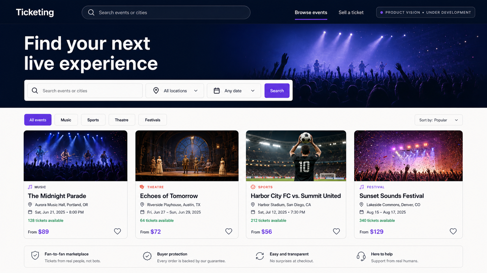
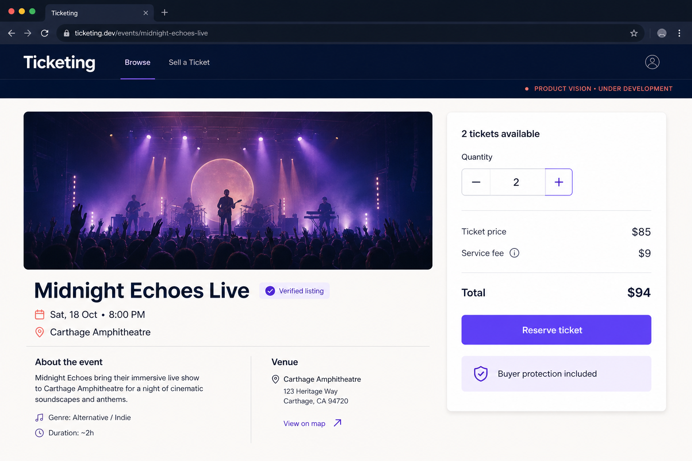
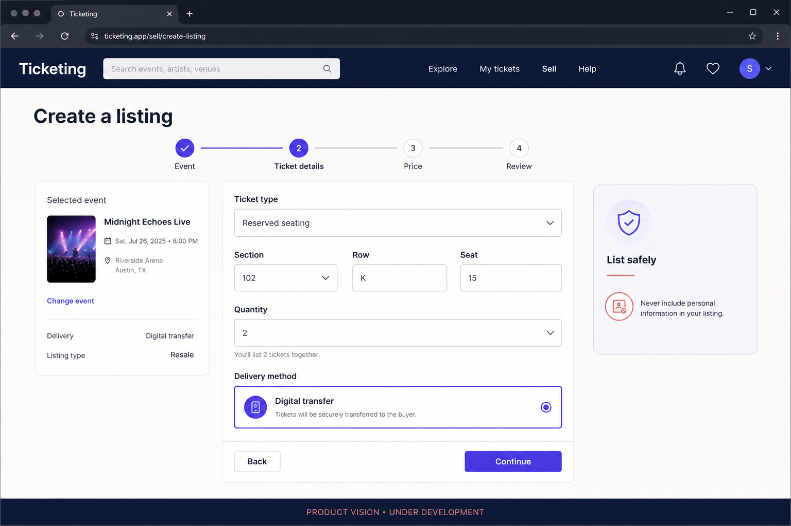
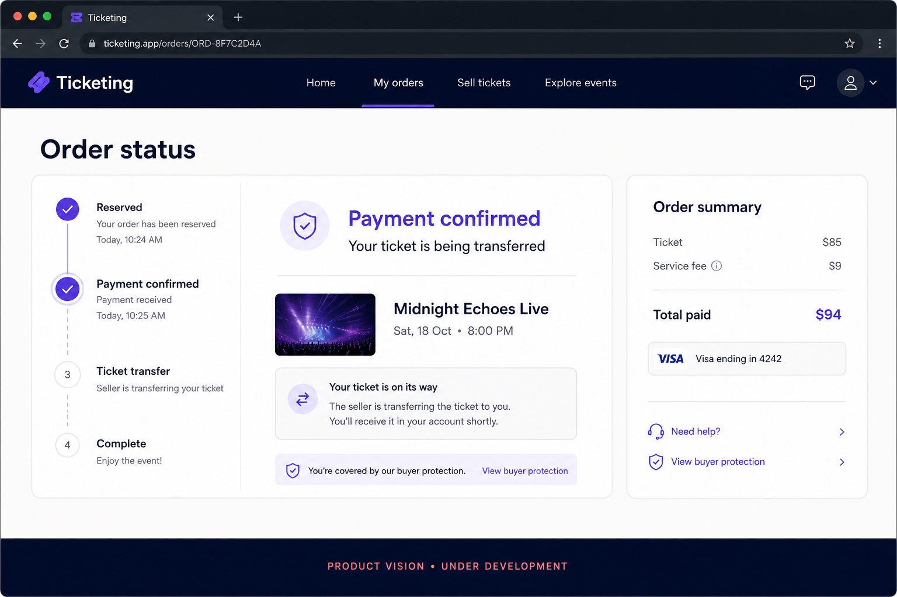
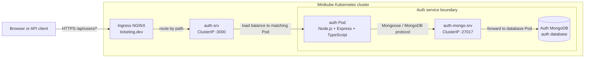
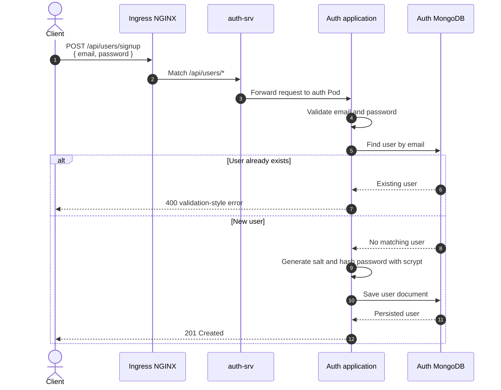

<div align="center">

# Ticketing

### A microservices learning platform built around a ticket marketplace

[](https://www.typescriptlang.org/)
[](https://nodejs.org/)
[](https://kubernetes.io/)
[](https://www.docker.com/)
[](#project-status)

A production-minded backend built incrementally to explore service boundaries, container orchestration, data ownership, and reliable distributed-system design.

</div>



> **Product-vision concept:** this interface illustrates the intended marketplace experience. The current repository implements the authentication foundation and local Kubernetes infrastructure—not the customer-facing marketplace shown above.

<p align="center">
  <a href="#project-status">Current status</a> ·
  <a href="#current-system-design">System design</a> ·
  <a href="#run-locally-with-kubernetes">Run locally</a> ·
  <a href="docs/system-architecture.md">Architecture reference</a> ·
  <a href="docs/infrastructure-guide.md">Infrastructure guide</a>
</p>

## Why This Project Exists

Ticketing is an evolving backend for a marketplace where users will be able to list tickets and purchase tickets listed by other users. The business idea is intentionally straightforward; the engineering challenge is building it as a collection of independently deployable services without losing correctness when data and workflows cross service boundaries.

The project is being used to develop practical experience with:

- defining a clear responsibility and database boundary for each service;
- packaging TypeScript services as Docker images;
- deploying and networking workloads inside Kubernetes;
- exposing multiple services through one Ingress entry point;
- automating the local build/deploy feedback loop with Skaffold;
- evolving authentication, event-driven communication, consistency, testing, and observability in deliberate stages.

This repository currently delivers the first vertical slice: an **authentication service backed by its own MongoDB instance**, deployed to a local Kubernetes cluster.

## Project Status

> **Active development / learning project.** The infrastructure foundation and signup persistence flow are implemented. This is not yet a complete marketplace or a production-ready system.

| Capability | Status | Notes |
|---|---:|---|
| Auth service and routing | Implemented | Express routes are exposed under `/api/users` |
| Signup validation | Implemented | Email format and password length are validated |
| User persistence | Implemented | Users are stored in the auth-owned MongoDB database |
| Password hashing | Implemented | Passwords are salted and hashed with Node.js `scrypt` before storage |
| Signin, signout, current user | Scaffolded | Routes exist; business logic and HTTP responses remain to be implemented |
| Local Kubernetes deployment | Implemented | Deployments, Services, Ingress, and Skaffold workflow are present |
| Automated tests | Not started | A test runner and test suites still need to be added |
| Tickets, orders, expiration, payments | Planned | These services are part of the target architecture, not the current repository |

## Product Vision — Concept Mockups

> **These screens are design concepts, not implemented application features.** They illustrate the intended customer experience while the backend and marketplace services are under active development.

The hero image above establishes the event-discovery direction. The following focused screens explore later steps in the planned customer journey.

### Review a ticket listing



### Create a listing



### Track an order



The concepts establish a shared visual direction for future frontend work: a deep-navy and warm-neutral palette, accessible violet actions, explicit buyer-protection messaging, and calm status communication without false urgency. Final screens may change as user flows and service contracts are implemented and tested.

## Current System Design

The deployed system has one public entry point. Ingress NGINX routes user-related requests to a stable Kubernetes Service. That Service selects the current auth Pod, and the auth application accesses MongoDB through a separate internal Service.



### What the diagram means

- **Client → Ingress:** `ticketing.dev` is the single external address used during local development.
- **Ingress → `auth-srv`:** requests matching `/api/users/*` are routed to the auth Kubernetes Service.
- **`auth-srv` → auth Pod:** the Service gives clients a stable address even when Kubernetes replaces a Pod.
- **auth Pod → `auth-mongo-srv`:** the application never depends on a temporary database Pod IP.
- **MongoDB:** authentication data is owned by the auth boundary. Future services should not read this database directly.

The current manifests run one application Pod and one non-persistent MongoDB Pod. This is appropriate for local learning, but it does **not** provide production durability or high availability.

## Signup Request Flow

The signup endpoint is the first implemented end-to-end business path.



This flow keeps validation and identity rules inside the auth service. The password hashing hook runs in the model before a modified password is saved, which prevents route handlers from accidentally persisting plain-text credentials.

## Design Decisions

### Database per service

The auth service owns its MongoDB database. This prevents future services from coupling themselves to auth's internal schema and allows the auth service to evolve independently. The trade-off is that future cross-service workflows cannot rely on database joins or shared transactions; they will require explicit APIs or events.

### Kubernetes Service in front of each workload

Pods are replaceable and receive temporary network addresses. A Kubernetes Service provides stable discovery and forwards traffic to Pods selected by labels. Both the application and database use this pattern.

### Ingress as the public boundary

Clients should not need to know which internal service handles a request. Ingress centralizes host/path routing while internal Services remain private to the cluster. As new HTTP services are added, new route prefixes can be mapped at this boundary.

### Shared errors are intentionally local for now

The auth service has typed application errors and one error-handling middleware. Extracting a shared package before a second service exists would add publishing and versioning complexity without proven reuse. A shared library becomes justified when another service needs the same stable contract.

## Technology Choices

| Area | Technology | Responsibility |
|---|---|---|
| Language | TypeScript | Static checks and explicit application contracts |
| Runtime/API | Node.js, Express 5 | HTTP routing and middleware pipeline |
| Validation | `express-validator` | Request-level validation for auth endpoints |
| Data | MongoDB, Mongoose | Auth-owned document persistence and model hooks |
| Credential security | Node.js `crypto.scrypt` | Salted password hashing and comparison |
| Packaging | Docker | Reproducible service image |
| Orchestration | Kubernetes via Minikube | Local workload scheduling, discovery, and routing |
| Edge routing | Ingress NGINX | Host- and path-based entry point |
| Developer workflow | Skaffold | Build, deploy, log streaming, and source synchronization |

## Repository Map

```text
ticketing-app/
├── auth/                         # Authentication microservice
│   ├── src/
│   │   ├── errors/               # Typed operational HTTP errors
│   │   ├── middlewares/          # Central Express error translation
│   │   ├── models/               # Mongoose user model and save hook
│   │   ├── routes/               # /api/users route handlers
│   │   ├── services/             # Password hashing/comparison logic
│   │   └── index.ts              # App composition, DB connection, server startup
│   ├── Dockerfile                # Auth development image
│   ├── package.json              # Dependencies and npm scripts
│   └── tsconfig.json             # Strict TypeScript configuration
├── infra/k8s/
│   ├── auth-depl.yaml            # Auth Deployment and ClusterIP Service
│   ├── auth-mongo-depl.yaml      # MongoDB Deployment and ClusterIP Service
│   └── ingress-srv.yaml          # ticketing.dev /api/users routing rule
├── docs/
│   ├── infrastructure-guide.md   # Docker/Kubernetes concepts and walkthrough
│   └── system-architecture.md    # Living architecture reference
├── skaffold.yaml                 # Local build/deploy/sync configuration
└── README.md                     # Project overview and portfolio landing page
```

## API Surface

| Method | Route | Current behavior |
|---|---|---|
| `POST` | `/api/users/signup` | Validates input, rejects a duplicate email, hashes the password, and creates a user |
| `POST` | `/api/users/signin` | Route exists; implementation is pending |
| `POST` | `/api/users/signout` | Route exists; implementation is pending |
| `GET` | `/api/users/currentuser` | Route exists; implementation is pending |

Signup request example:

```bash
curl --insecure \
  --request POST \
  https://ticketing.dev/api/users/signup \
  --header 'Content-Type: application/json' \
  --data '{"email":"engineer@example.com","password":"securepass"}'
```

`--insecure` is needed only for the local HTTPS setup because it does not use a publicly trusted production certificate.

## Run Locally with Kubernetes

### Prerequisites

Install and verify:

- Docker
- `kubectl`
- Minikube
- Skaffold

```bash
docker --version
kubectl version --client
minikube version
skaffold version
```

### 1. Start the cluster

```bash
minikube start --driver=docker
minikube addons enable ingress
```

The first command creates a local Kubernetes cluster using Docker. The second installs the NGINX controller that implements the repository's Ingress rules.

### 2. Map the development hostname

Get the cluster IP:

```bash
minikube ip
```

Add it to `/etc/hosts` on the host machine:

```text
<minikube-ip> ticketing.dev
```

For example: `192.168.49.2 ticketing.dev`. This local mapping is machine-specific and must not be committed.

### 3. Start the development workflow

```bash
skaffold dev
```

Skaffold builds `mossajross/auth`, applies every manifest in `infra/k8s`, streams workload logs, and synchronizes TypeScript source changes into the running auth container.

### 4. Verify the deployment

```bash
kubectl get deployments,pods,services,ingress
curl --insecure https://ticketing.dev/api/users/currentuser
```

The route handler is currently a placeholder, so this request is useful for checking routing but does not yet return current-user data.

## Development Without Kubernetes

The auth process expects MongoDB at the Kubernetes DNS name `auth-mongo-srv`, so running only `npm start` outside the cluster is insufficient for persistence. For static verification, you can still install dependencies and run the TypeScript compiler:

```bash
cd auth
npm install
npm run typecheck
```

`npm run typecheck` executes `tsc --noEmit`: it checks the program without generating JavaScript files.

## Target Architecture

The intended marketplace will grow by business capability rather than by technical layer. Each service will own its data and publish facts that other services need, avoiding direct database access across boundaries.

```mermaid
flowchart TB
    Client[Web client] --> Ingress[Ingress / API entry point]

    Ingress --> Auth[Auth service]
    Ingress --> Tickets[Tickets service]
    Ingress --> Orders[Orders service]
    Ingress --> Payments[Payments service]

    Auth --> AuthDB[(Auth DB)]
    Tickets --> TicketsDB[(Tickets DB)]
    Orders --> OrdersDB[(Orders DB)]
    Payments --> PaymentsDB[(Payments DB)]

    Auth -. domain events .-> Bus[(Event bus)]
    Tickets -. domain events .-> Bus
    Orders -. domain events .-> Bus
    Payments -. domain events .-> Bus
    Expiration[Expiration worker] <. events .> Bus
```

This is a **direction**, not a claim about the current code. An event bus becomes valuable when ticket reservation, order expiration, and payment completion must coordinate without sharing databases. It should be introduced only alongside those workflows, including idempotency, retries, and event-versioning rules.

## Reliability and Security Notes

Implemented safeguards:

- signup inputs are validated before database access;
- duplicate email addresses are rejected at the application level;
- passwords are salted and hashed before persistence;
- expected application failures use a consistent `{ errors: [...] }` response shape;
- unexpected errors are translated to a generic response instead of exposing an internal stack trace.

Known gaps before production use:

- the user schema does not yet enforce a unique database index on email;
- signup currently returns the persisted model and should explicitly omit the password hash;
- there are no sessions/JWTs, authorization rules, rate limits, or abuse controls;
- the MongoDB workload has no persistent volume, authentication, backup, or replica set;
- Deployments have no health probes, resource requests/limits, or hardened security contexts;
- the Docker image runs a watch-mode development process and is not a production build;
- application configuration such as the MongoDB URL is hard-coded rather than injected;
- automated tests, CI, structured logs, metrics, and distributed traces are not present.

These gaps are documented deliberately: a production-ready label should follow evidence, not precede it.

## Roadmap

The next useful steps are ordered to strengthen the existing slice before multiplying services:

1. Complete signin, signout, current-user, and cookie/session behavior.
2. Add route integration tests using an isolated MongoDB test environment.
3. Prevent credential fields from appearing in API responses and enforce email uniqueness in MongoDB.
4. Separate Express app construction from process startup to improve testability.
5. Add production container builds, environment-based configuration, health probes, and resource limits.
6. Introduce the tickets service with its own database and public route boundary.
7. Add orders and expiration workflows; introduce an event bus only when asynchronous coordination is required.
8. Add payments behind an external-provider adapter, followed by idempotency and failure recovery.
9. Establish CI, observability, secret management, and a production deployment strategy.

## Engineering Documentation

- [System architecture](docs/system-architecture.md) — current resources, responsibilities, and request paths.
- [Infrastructure guide](docs/infrastructure-guide.md) — an in-depth learning guide to Docker, Kubernetes, Minikube, Ingress NGINX, and Skaffold.

## What This Project Demonstrates

Even at its current stage, the repository demonstrates more than an Express CRUD endpoint. It shows a complete path from validated HTTP input, through application and persistence boundaries, into a containerized service deployed and discovered inside Kubernetes. Just as importantly, it records the limitations and the reasoning behind future architectural steps—because production engineering is as much about knowing what is **not yet guaranteed** as it is about making the happy path work.

## License

No repository-level license has been added yet. Until one is chosen, the source is available for viewing but should not be assumed to grant reuse or redistribution rights.
