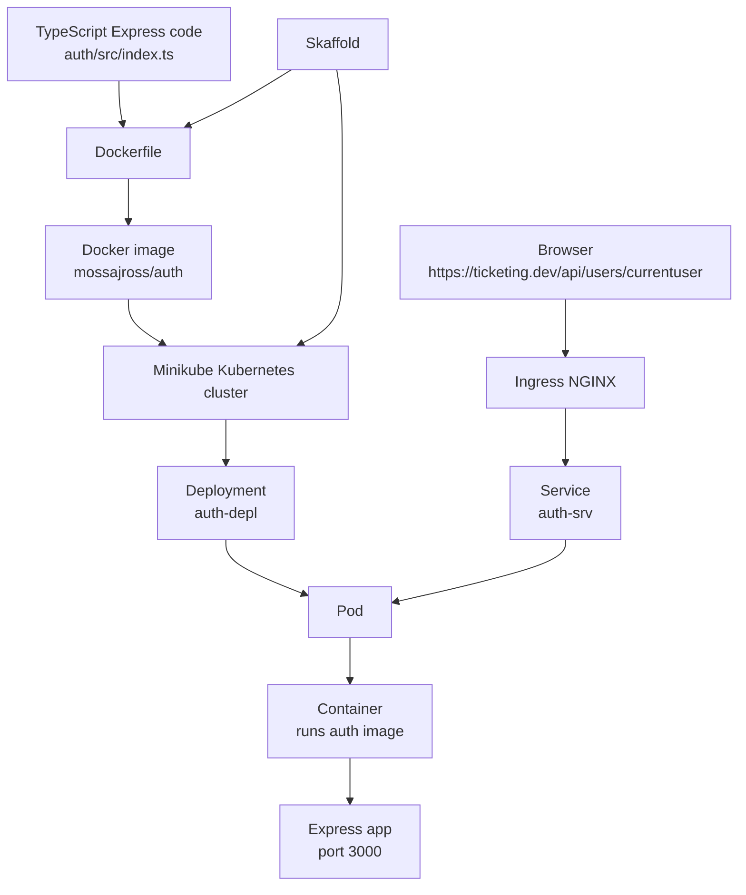
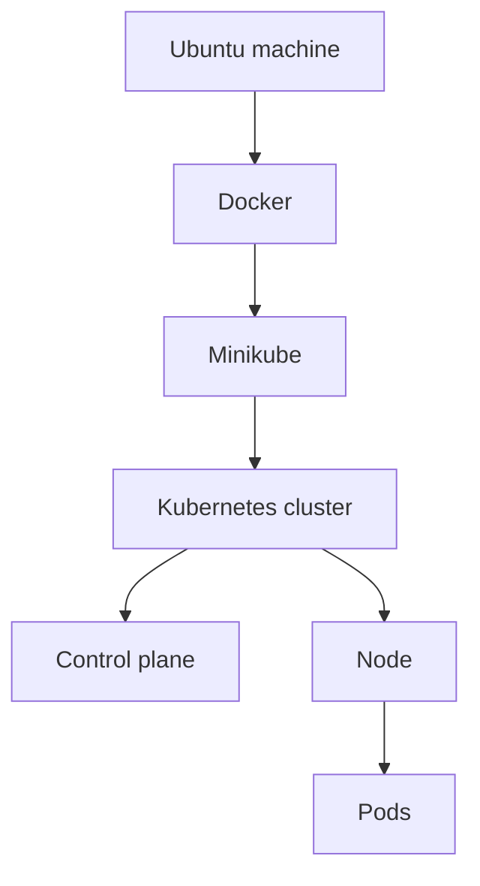
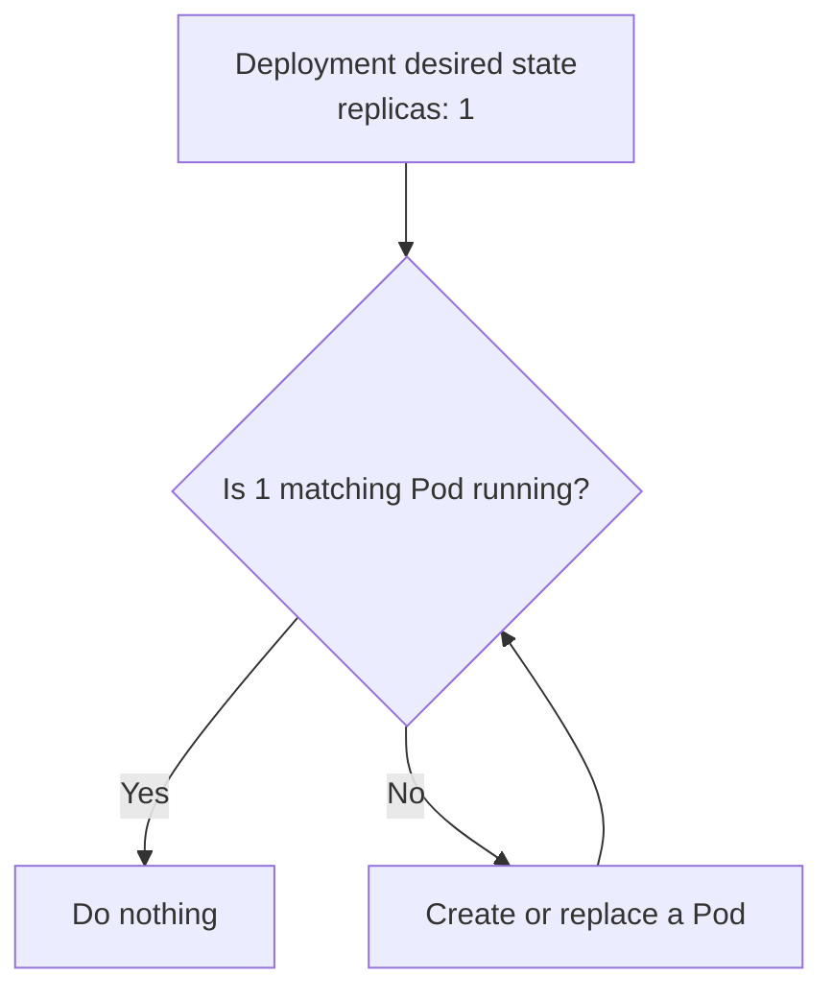
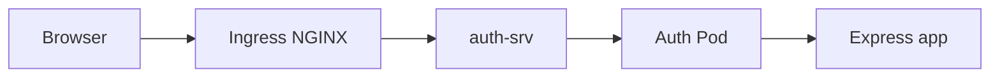
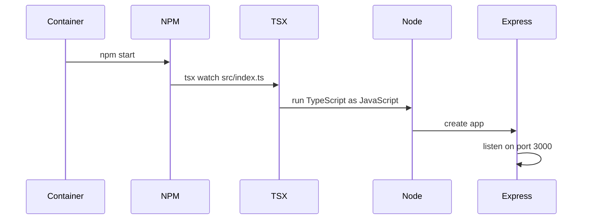
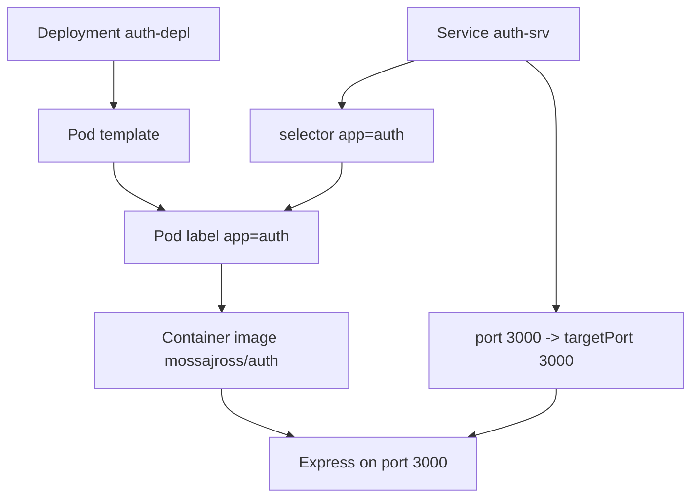
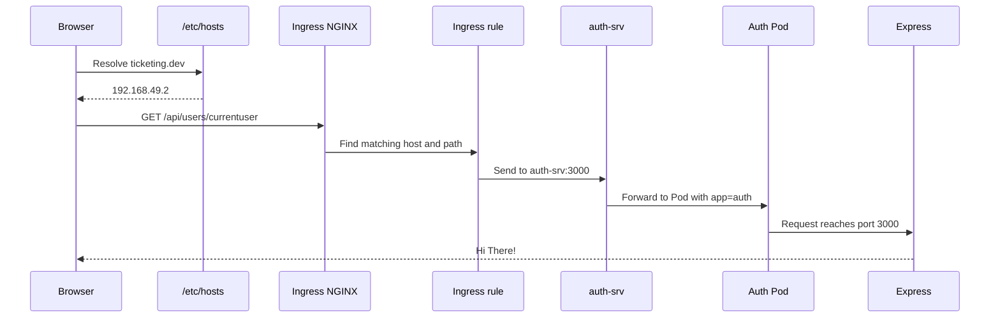
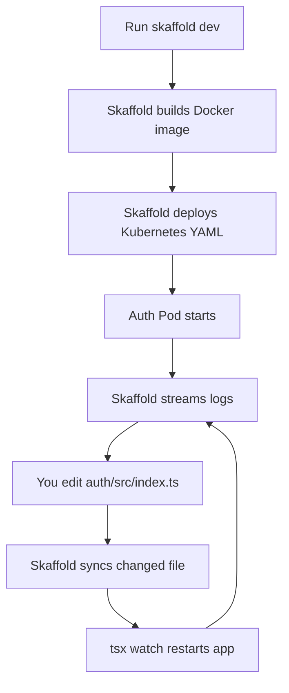

# Infrastructure Guide: Docker, Kubernetes, Minikube, Ingress NGINX, and Skaffold

This guide explains the local infrastructure for this project from first principles.

The goal is not only to run this exact repo. The goal is to understand the pattern well enough that you can create a similar setup yourself for another microservice.

## 1. The Big Picture

This project currently has one service:

```txt
auth
```

The service is an Express app written in TypeScript. We package it with Docker, run it in Kubernetes through Minikube, expose it with a Kubernetes Service, route browser traffic through Ingress NGINX, and automate the development loop with Skaffold.



The short version:

```txt
Docker packages the app.
Kubernetes runs and manages the app.
Service gives the app a stable internal address.
Ingress exposes HTTP routes from outside the cluster.
Skaffold automates build, deploy, logs, and file sync during development.
```

## 2. The Main Concepts

### Docker Image

A Docker image is a packaged version of the app.

It contains:

- a base operating system layer
- Node.js
- project files
- installed dependencies
- the command used to start the app

An image is not running. It is more like a runnable package.

```txt
Image = packaged app
Container = running instance of that image
```

### Kubernetes Cluster

A Kubernetes cluster is the environment that runs your containerized apps.

In this project, Minikube creates a local Kubernetes cluster on your Ubuntu machine.



### Control Plane

The control plane is the brain of Kubernetes.

It contains pieces like:

- API server: receives `kubectl` and Skaffold requests
- scheduler: decides which node should run a Pod
- controller manager: keeps reality matching the desired state
- etcd: stores cluster state

You usually do not talk to these pieces directly. You talk to the API server with `kubectl`.

### Node

A node is a machine where Pods run.

In Minikube, the node is local. In production, nodes are usually cloud virtual machines or real servers.

### Pod

A Pod is the smallest runnable unit in Kubernetes.

Kubernetes does not directly run your Docker image alone. Kubernetes creates a Pod, and the Pod contains one or more containers.

For this project:

```txt
1 auth Pod contains 1 auth container.
```

### Deployment

A Deployment manages Pods.

You do not usually create Pods manually for long-running services. You create a Deployment and say:

```txt
I want 1 copy of auth running.
```

Kubernetes then keeps that true.



### Service

A Service gives stable network access to Pods.

Pods are temporary. A Pod can die and be replaced with a new Pod that has a different internal IP address.

The Service stays stable.

```txt
Client talks to Service.
Service forwards to the current matching Pods.
```

### Ingress

An Ingress defines HTTP routing rules.

Example:

```txt
Requests for ticketing.dev/api/users/... should go to auth-srv.
```

### Ingress Controller

An Ingress object is only configuration. Something must actually read the rules and route traffic.

That running router is called an Ingress Controller.

In this project, the controller is Ingress NGINX.

### Ingress NGINX

Ingress NGINX is an NGINX-based reverse proxy running inside Kubernetes.

A reverse proxy receives traffic first, then forwards it to the correct internal service.



### Skaffold

Skaffold is a local development automation tool.

Without Skaffold, the loop is manual:

```txt
Change code
Build Docker image
Deploy Kubernetes YAML
Check Pod logs
Repeat
```

With Skaffold:

```txt
skaffold dev
```

automates that loop.

## 3. Project File Map

Important files:

```txt
auth/
  Dockerfile
  .dockerignore
  package.json
  src/
    index.ts

infra/
  k8s/
    auth-depl.yaml
    ingress-srv.yaml

skaffold.yaml
```

Responsibility split:

```txt
auth/Dockerfile
  tells Docker how to package the auth app

infra/k8s/auth-depl.yaml
  tells Kubernetes how to run and internally expose auth

infra/k8s/ingress-srv.yaml
  tells Ingress NGINX how to route browser traffic to auth

skaffold.yaml
  tells Skaffold how to build and deploy everything during development
```

## 4. Dockerfile Explained

Current file: `auth/Dockerfile`

```dockerfile
FROM node:alpine

WORKDIR  /app
COPY package.json .
RUN npm install
COPY . .

CMD ["npm", "start"]
```

### `FROM node:alpine`

This chooses the base image.

`node:alpine` means:

```txt
Start from a small Linux image that already has Node.js installed.
```

Docker builds your app on top of this base.

### `WORKDIR /app`

This sets the working directory inside the image.

After this line, future commands run inside:

```txt
/app
```

So:

```dockerfile
RUN npm install
```

means:

```bash
cd /app
npm install
```

inside the image.

### `COPY package.json .`

This copies `auth/package.json` from your machine into `/app/package.json` inside the image.

The `.` means the current working directory inside the image, which is `/app`.

### `RUN npm install`

This installs dependencies inside the image.

It creates:

```txt
/app/node_modules
```

### `COPY . .`

This copies the rest of the `auth` folder into `/app`.

Your `.dockerignore` contains:

```txt
node_modules
```

That means your local `auth/node_modules` is not copied into the image. This is correct because dependencies should be installed inside the image environment.

### `CMD ["npm", "start"]`

This is the default command when a container starts from the image.

Your `auth/package.json` contains:

```json
"start": "tsx watch src/index.ts"
```

So container startup becomes:

```txt
Container starts
  -> npm start
    -> tsx watch src/index.ts
      -> Express app listens on port 3000
```

## 5. The Auth App Runtime

The app listens on port `3000`:

```ts
app.get('/api/users/currentuser', (req, res) => {
  res.send('Hi There!')
})

app.listen(3000, () => {
  console.log("Auth Service listening on port 3000")
})
```

That means any Kubernetes Service or Ingress rule must eventually send traffic to port `3000`.

Runtime sequence:



## 6. Kubernetes Deployment and Service YAML

Current file: `infra/k8s/auth-depl.yaml`

This file contains two Kubernetes objects:

```txt
Deployment
Service
```

The `---` separator means:

```txt
The first YAML document ends.
The next YAML document starts.
```

### Deployment

```yaml
apiVersion: apps/v1
kind: Deployment
metadata:
  name: auth-depl
spec:
  replicas: 1
  selector:
    matchLabels:
      app: auth
  template:
    metadata:
      labels:
        app: auth
    spec:
      containers:
        - name: auth
          image: mossajross/auth
          ports:
            - containerPort: 3000
```

Line by line:

```yaml
apiVersion: apps/v1
```

This says the object uses the `apps/v1` Kubernetes API.

Deployments live in `apps/v1`.

```yaml
kind: Deployment
```

This says the object type is a Deployment.

```yaml
metadata:
  name: auth-depl
```

This names the Deployment `auth-depl`.

You can inspect it with:

```bash
kubectl get deployment auth-depl
```

```yaml
spec:
```

`spec` means desired state.

It describes what Kubernetes should make true.

```yaml
replicas: 1
```

This asks Kubernetes to keep one auth Pod running.

```yaml
selector:
  matchLabels:
    app: auth
```

This tells the Deployment which Pods it owns.

It owns Pods with:

```txt
app=auth
```

```yaml
template:
```

This is the Pod blueprint.

The Deployment creates Pods from this template.

```yaml
metadata:
  labels:
    app: auth
```

Every Pod created by this Deployment gets the label `app=auth`.

This label is important because the Service also uses it.

```yaml
containers:
  - name: auth
```

This Pod has one container named `auth`.

```yaml
image: mossajross/auth
```

This is the Docker image Kubernetes runs.

This must match the image name Skaffold builds.

```yaml
ports:
  - containerPort: 3000
```

This documents that the container listens on port `3000`.

It should match:

```ts
app.listen(3000)
```

### Service

```yaml
apiVersion: v1
kind: Service
metadata:
  name: auth-srv
spec:
  selector:
    app: auth
  ports:
    - name: auth
      protocol: TCP
      port: 3000
      targetPort: 3000
```

Line by line:

```yaml
apiVersion: v1
```

Services are part of the core Kubernetes API, so they use `v1`.

```yaml
kind: Service
```

This creates a Service.

```yaml
metadata:
  name: auth-srv
```

This names the Service `auth-srv`.

Inside the cluster, other things can reach it by this name.

```yaml
selector:
  app: auth
```

This tells the Service:

```txt
Send traffic to Pods with label app=auth.
```

That matches the Pod label from the Deployment.

```yaml
port: 3000
```

This is the Service port.

```yaml
targetPort: 3000
```

This is the Pod/container port that traffic gets forwarded to.

So the network mapping is:

```txt
auth-srv:3000 -> auth Pod:3000 -> Express app
```

### Deployment and Service Together



The most important connection is:

```txt
Service selector app=auth
matches
Pod label app=auth
```

If those do not match, the Service will not send traffic to the Pod.

## 7. Ingress YAML

Current file: `infra/k8s/ingress-srv.yaml`

```yaml
apiVersion: networking.k8s.io/v1
kind: Ingress
metadata:
  name: ingress-service
  annotations:
    nginx.ingress.kubernetes.io/use-regex: 'true'
spec:
  ingressClassName: nginx
  rules:
    - host: ticketing.dev
      http:
        paths:
          - path: /api/users/?(.*)
            pathType: ImplementationSpecific
            backend:
              service:
                name: auth-srv
                port:
                  number: 3000
```

This object tells Ingress NGINX how to route HTTP requests.

### `apiVersion: networking.k8s.io/v1`

Ingress belongs to the `networking.k8s.io/v1` API.

Older tutorials may use:

```yaml
extensions/v1beta1
```

That is outdated and does not work on modern Kubernetes versions.

### `kind: Ingress`

This creates an Ingress object.

The Ingress describes external HTTP routing rules.

### `metadata.name`

```yaml
metadata:
  name: ingress-service
```

This names the Ingress object.

Inspect it with:

```bash
kubectl describe ingress ingress-service
```

### Annotation

```yaml
annotations:
  nginx.ingress.kubernetes.io/use-regex: 'true'
```

Annotations are extra metadata used by tools.

This annotation is read by Ingress NGINX.

It means:

```txt
Treat path values as regex patterns.
```

Regex means regular expression, a pattern-matching language.

### `ingressClassName: nginx`

```yaml
spec:
  ingressClassName: nginx
```

This says:

```txt
The NGINX ingress controller should handle this Ingress.
```

This matters because a cluster can have more than one Ingress controller.

### Host Rule

```yaml
rules:
  - host: ticketing.dev
```

This rule only applies to requests whose host is:

```txt
ticketing.dev
```

The host is the domain name in the request.

For local development, `/etc/hosts` maps that name to the Minikube IP.

Example:

```txt
192.168.49.2 ticketing.dev
```

### Path Rule

```yaml
path: /api/users/?(.*)
```

This matches paths like:

```txt
/api/users
/api/users/
/api/users/currentuser
```

Because regex is enabled, `?(.*)` is treated as a pattern.

### `pathType: ImplementationSpecific`

```yaml
pathType: ImplementationSpecific
```

Kubernetes requires a path type for modern Ingress.

`ImplementationSpecific` means:

```txt
Let the Ingress controller decide exactly how this path is interpreted.
```

That fits NGINX regex paths.

### Backend Service

```yaml
backend:
  service:
    name: auth-srv
    port:
      number: 3000
```

This says:

```txt
When the host and path match, forward the request to auth-srv on port 3000.
```

Full request flow:



## 8. Skaffold YAML

Current file: `skaffold.yaml`

```yaml
apiVersion: skaffold/v2alpha3
kind: Config
deploy:
  kubectl:
    manifests:
      - ./infra/k8s/*
build:
  local:
    push: false
  artifacts:
    - image: mossajross/auth
      context: auth
      docker:
        dockerfile: Dockerfile
      sync:
        manual:
          - src: './src/**/*.ts'
            dest: .
```

Skaffold ties Docker and Kubernetes together for local development.

### `apiVersion`

```yaml
apiVersion: skaffold/v2alpha3
```

This is the Skaffold config version.

If your Skaffold binary is newer or older and complains about this version, run:

```bash
skaffold fix
```

That upgrades the config to a version your installed Skaffold understands.

### `kind: Config`

This tells Skaffold the file is a Skaffold configuration.

### Deploy Section

```yaml
deploy:
  kubectl:
    manifests:
      - ./infra/k8s/*
```

This means:

```txt
Use kubectl to deploy all YAML files in infra/k8s.
```

Roughly equivalent to:

```bash
kubectl apply -f ./infra/k8s/*
```

### Build Section

```yaml
build:
  local:
    push: false
```

This means:

```txt
Build images locally.
Do not push them to Docker Hub.
```

For Minikube development, `push: false` is normal.

### Artifacts

```yaml
artifacts:
  - image: mossajross/auth
    context: auth
```

An artifact is one image Skaffold builds.

This says:

```txt
Build image mossajross/auth from the auth folder.
```

This image name must match the Kubernetes Deployment image:

```yaml
image: mossajross/auth
```

### Docker Build Config

```yaml
docker:
  dockerfile: Dockerfile
```

Because the context is `auth`, this points to:

```txt
auth/Dockerfile
```

### File Sync

```yaml
sync:
  manual:
    - src: './src/**/*.ts'
      dest: .
```

This tells Skaffold:

```txt
When a TypeScript file changes under auth/src,
copy it into the running container instead of rebuilding the whole image.
```

Because the Dockerfile sets:

```dockerfile
WORKDIR /app
```

and copies code into `/app`, the file sync updates files under `/app`.

Then `tsx watch src/index.ts` sees the change and restarts the process.

Development loop:



## 9. How Everything Starts

### Step 1: Start Minikube

```bash
minikube start --driver=docker
```

Meaning:

```txt
Create or start a local Kubernetes cluster using Docker as the backend.
```

Verify:

```bash
minikube status
kubectl get nodes
```

Healthy status should include:

```txt
host: Running
kubelet: Running
apiserver: Running
```

If the API server is stopped, `kubectl` and Skaffold cannot work.

### Step 2: Enable Ingress

```bash
minikube addons enable ingress
```

Meaning:

```txt
Install Ingress NGINX into the Minikube cluster.
```

Verify:

```bash
kubectl get pods -n ingress-nginx
```

### Step 3: Configure Local DNS With `/etc/hosts`

Get the Minikube IP:

```bash
minikube ip
```

Example:

```txt
192.168.49.2
```

Edit `/etc/hosts`:

```bash
sudo nano /etc/hosts
```

Add or update:

```txt
192.168.49.2 ticketing.dev
```

This tells your computer:

```txt
When I request ticketing.dev, send the traffic to Minikube.
```

Important: modern browsers force `.dev` domains to HTTPS.

Use:

```txt
https://ticketing.dev/api/users/currentuser
```

### Step 4: Start Skaffold

From the repo root:

```bash
skaffold dev
```

Skaffold will:

```txt
1. Build the Docker image.
2. Deploy the Kubernetes YAML files.
3. Stream logs.
4. Watch for code changes.
5. Sync changed files into the running container.
```

## 10. Request Flow From Browser to Express

When you visit:

```txt
https://ticketing.dev/api/users/currentuser
```

this is what happens:

```mermaid
flowchart TD
  A[Browser requests ticketing.dev] --> B[/etc/hosts]
  B --> C[Minikube IP 192.168.49.2]
  C --> D[Ingress NGINX Controller]
  D --> E[Ingress rule<br/>host ticketing.dev<br/>path /api/users/?(.*)]
  E --> F[Service auth-srv:3000]
  F --> G[Pod with label app=auth]
  G --> H[Container running mossajross/auth]
  H --> I[Express route<br/>/api/users/currentuser]
  I --> J[Response: Hi There!]
```

The important routing connections:

```txt
/etc/hosts:
ticketing.dev -> Minikube IP

Ingress:
ticketing.dev + /api/users/?(.*) -> auth-srv:3000

Service:
auth-srv -> Pods with label app=auth

Deployment:
creates Pods with label app=auth

Container:
listens on port 3000
```

## 11. Debugging Checklist

When something does not work, check each layer in order.

### 1. Is Minikube healthy?

```bash
minikube status
kubectl get nodes
```

If the API server is not running, fix Minikube first.

### 2. Are the Pods running?

```bash
kubectl get pods
```

Expected:

```txt
auth-depl-...   1/1   Running
```

If not, inspect:

```bash
kubectl describe pod <pod-name>
kubectl logs <pod-name>
```

### 3. Does the Service exist?

```bash
kubectl get svc
```

Expected:

```txt
auth-srv   ClusterIP   ...   3000/TCP
```

### 4. Does the Service select the Pod?

```bash
kubectl describe svc auth-srv
```

Look for endpoints.

If there are no endpoints, the Service selector does not match the Pod labels.

### 5. Does the Ingress exist?

```bash
kubectl get ingress
kubectl describe ingress ingress-service
```

Expected route:

```txt
ticketing.dev /api/users/?(.*) -> auth-srv:3000
```

### 6. Does direct Ingress access work?

Get the Minikube IP:

```bash
minikube ip
```

Then test:

```bash
curl -k -H 'Host: ticketing.dev' https://192.168.49.2/api/users/currentuser
```

Expected:

```txt
Hi There!
```

This bypasses `/etc/hosts` and tests the Ingress directly.

### 7. Does `/etc/hosts` point to Minikube?

```bash
grep ticketing.dev /etc/hosts
```

Expected:

```txt
192.168.49.2 ticketing.dev
```

If it says:

```txt
127.0.0.1 ticketing.dev
```

your browser will hit your local machine, not Minikube.

## 12. How to Reproduce This Pattern for Another Service

Suppose you add a new service called `tickets`.

You would usually create:

```txt
tickets/
  Dockerfile
  package.json
  src/index.ts

infra/k8s/tickets-depl.yaml
```

The repeated pattern is:

### Docker

Each service gets a Dockerfile that packages the service.

### Skaffold

Add a new artifact:

```yaml
artifacts:
  - image: mossajross/auth
    context: auth
    docker:
      dockerfile: Dockerfile
  - image: mossajross/tickets
    context: tickets
    docker:
      dockerfile: Dockerfile
```

### Deployment

Create a Deployment that runs the new image:

```yaml
apiVersion: apps/v1
kind: Deployment
metadata:
  name: tickets-depl
spec:
  replicas: 1
  selector:
    matchLabels:
      app: tickets
  template:
    metadata:
      labels:
        app: tickets
    spec:
      containers:
        - name: tickets
          image: mossajross/tickets
          ports:
            - containerPort: 3000
```

### Service

Create a Service that points to Pods labeled `app=tickets`:

```yaml
apiVersion: v1
kind: Service
metadata:
  name: tickets-srv
spec:
  selector:
    app: tickets
  ports:
    - name: tickets
      protocol: TCP
      port: 3000
      targetPort: 3000
```

### Ingress

Add a route:

```yaml
- path: /api/tickets/?(.*)
  pathType: ImplementationSpecific
  backend:
    service:
      name: tickets-srv
      port:
        number: 3000
```

The repeated idea is always:

```txt
Skaffold builds image.
Deployment runs image in Pods.
Service selects Pods by label.
Ingress routes external HTTP traffic to Service.
```

## 13. Common Mistakes

### Mistake: Service selector does not match Pod label

Bad:

```yaml
selector:
  app: auth
```

but Pod label:

```yaml
labels:
  app: users
```

Result:

```txt
Service has no endpoints.
Traffic goes nowhere.
```

### Mistake: Ingress points to wrong Service name

Bad:

```yaml
name: auth-service
```

but Service is:

```yaml
name: auth-srv
```

Result:

```txt
Ingress cannot route to the backend.
```

### Mistake: `/etc/hosts` points to `127.0.0.1`

Bad:

```txt
127.0.0.1 ticketing.dev
```

Correct:

```txt
192.168.49.2 ticketing.dev
```

Use your actual `minikube ip`.

### Mistake: using old Ingress API

Bad:

```yaml
apiVersion: extensions/v1beta1
```

Correct for modern Kubernetes:

```yaml
apiVersion: networking.k8s.io/v1
```

### Mistake: Skaffold config version mismatch

If you see:

```txt
unknown api version
```

run:

```bash
skaffold fix
```

or upgrade Skaffold.

## 14. Production Notes

This setup is good for learning and local development.

It is not production-ready yet.

Main reasons:

- The Dockerfile runs `tsx watch`, which is a development command.
- The container installs dev dependencies.
- There are no readiness or liveness probes.
- There are no resource limits.
- TLS is not properly configured with a trusted certificate.
- There is no secret management yet.

Later, a more production-like Node service should:

```txt
compile TypeScript to JavaScript
run node dist/index.js
install only production dependencies
define health checks
define CPU and memory limits
use real TLS certificates
```

For now, this setup is intentionally optimized for learning:

```txt
fast feedback
visible Kubernetes objects
simple routing
easy debugging
```

